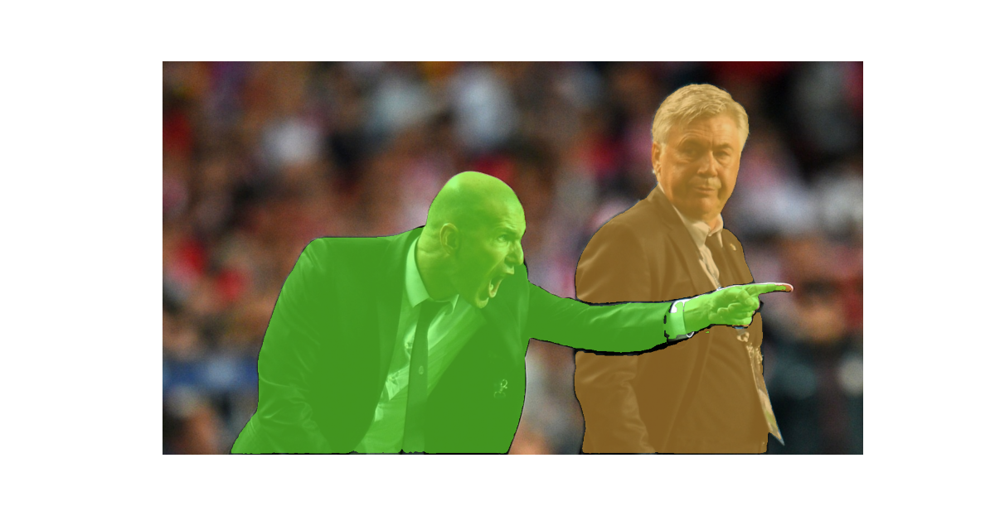

# auto-segment

 
  This repo contains different tools to generate your own segmentation datasets using your objcet detection YOLOv8 models. This work is a continuation of the article <a href="https://blog.roboflow.com/how-to-use-yolov8-with-sam/"> "How to use YOLOv8 with SAM" </a>published by Arty Ariuntuya on Roboflow, in which she explained the power of both models working together.

## 🎭 segmentation mask

  After performing object detection with YOLOv8, bounding boxes are sent to SAM, in order to make him understand which object do we want to get the mask from.

  

