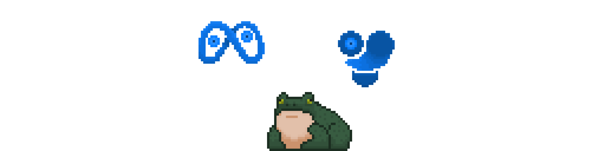
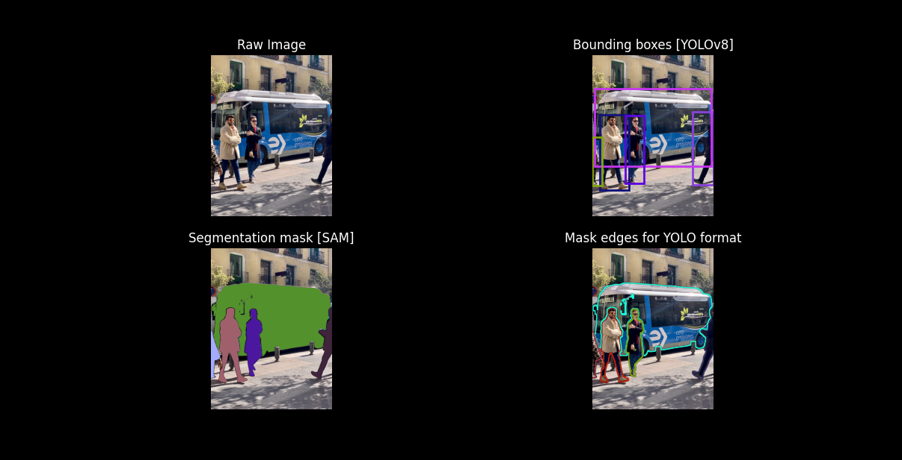
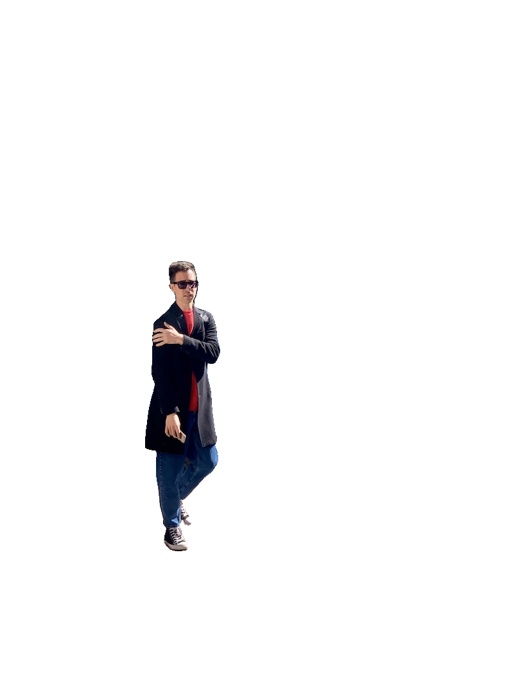
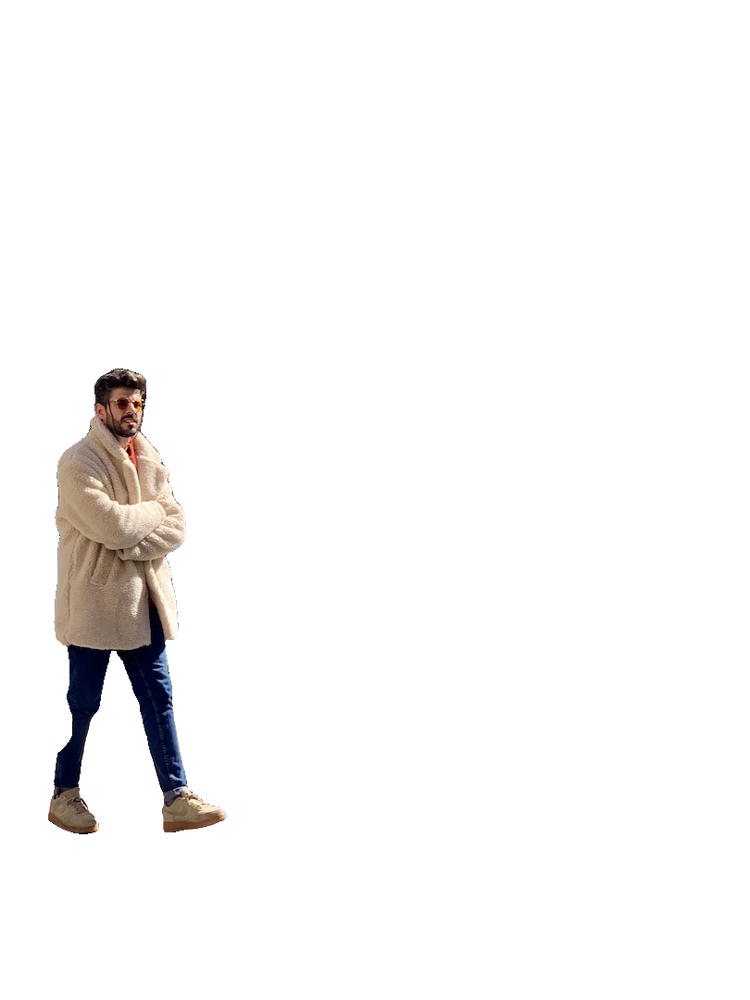
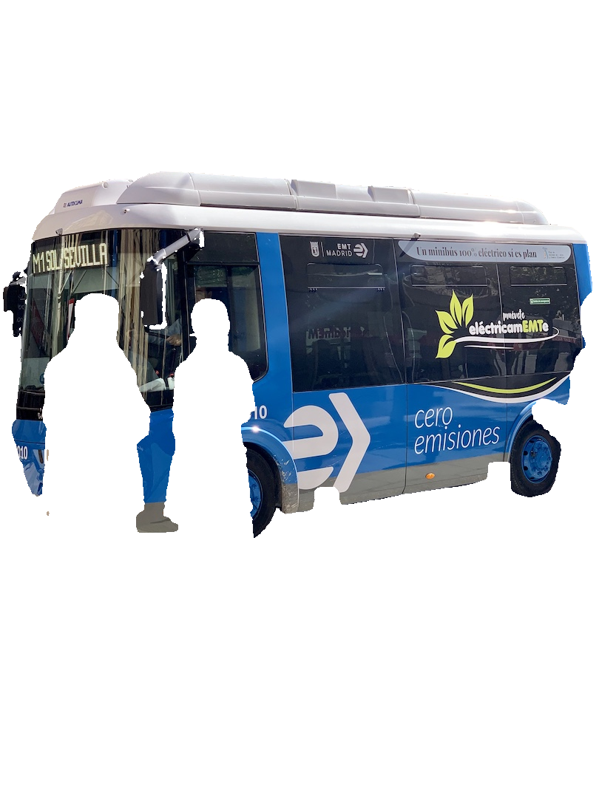
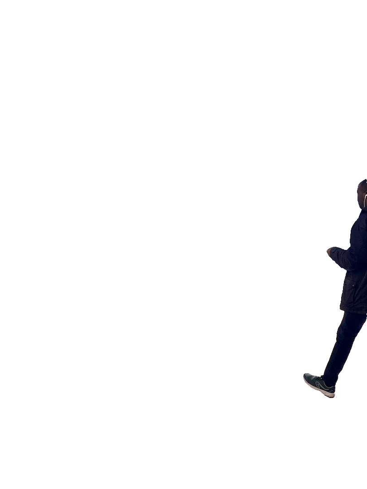

# auto-segment


<p align = "justify"> 
  This repo contains different tools to generate your own segmentation datasets using your object detection YOLOv8 models. This work is a continuation of the article <a href="https://blog.roboflow.com/how-to-use-yolov8-with-sam/"> "How to use YOLOv8 with SAM" </a>published by Arty Ariuntuya on Roboflow, in which she explained the power of both models working together.
</p>

<p align = "center">
  
</p>

<p align="center"><em>Auto-segment pixel-art by JVPC0D3R</em></p>

## 🎭 segmentation mask

<p align = "justify">
  After performing object detection with YOLOv8, bounding boxes are sent to SAM, in order to make him understand which object we want to get the mask from.
</p>

<p align = "center">
  
  
</p>
<p align="center"><em>SAM ft YOLOv8 masks example</em></p>

## 📦 installation

<p align = "justify">
  In order to use this repo you will need to install the following packages on your 3.8 Python environment:
</p>

```pip install roboflow ultralytics 'git+https://github.com/facebookresearch/segment-anything.git'```

<p align = "justify">
  Or you can install them from requirements:
</p>

```pip install -r requirements.txt```

<p align = "justify">
  After that you will download SAM weights using the following command:
</p>

```wget https://dl.fbaipublicfiles.com/segment_anything/sam_vit_h_4b8939.pth```

## 🏷️ segmentation dataset automation

<p align = "justify">
  This repo allows you atomate a YOLOv8 format segmentation dataset generation process. To start generating your dataset, you will need to copy all your images on the "images" folder, also you will need a custom YOLOv8 object detection model (copy the custom_yolov8.pt ckpt in the main folder).
</p>

```
0 0.6812 0.48541 0.67 0.4875 0.67656 0.487 0.675 0.489 0.66
1 0.5046 0.0 0.5015 0.004 0.4984 0.00416 0.4937 0.010 0.492 0.0104
```

<p align="center"><em>YOLOv8 segmentation dataset format</em></p>

<p align = "justify">
  In the "create_dataset.py" script, replace the "yolov8n.pt" string with yout custom YOLOv8 file. 
</p>

```python
# Load the YOLOv8 model
yolo = YOLO('your_custom_yolov8.pt')
```

<p align="justify">
  In order to run the script use the folowing command:
</p>

```python create_dataset.py```

<p align="justify">
  Keep in mind that this YOLOv8 model will only generate the bounding box for each object and will give that information to SAM.
</p>

<p align="justify">
  If you run a automatic labelling process on a large image folder the process may take a long time. The labels will be stored on the output folder with the same name as the source image with the txt extension.
</p>

## 👁️ view masks

<p align="justify">
  The view_masks.py script allows the user to visualize the different steps in the dataset generation process. In the figure below you can see the raw image, the bounding boxes created by YOLOv8, the binary mask created by SAM using YOLOv8 information, and the edges of those binary masks in order to get the YOLOV8 format. 
</p>

<p align = "center">
  
</p>

<p align="center"><em>view_masks.py output example</em></p>

## ✂️ crop detections

<p align="justify">
  This repo allows the user to crop the different detections automatically with precission, to run it you will use the following command.
</p>

```python crop_objects.py```

<p align = "center">
  
  
  
  
</p>

<p align="center"><em>crop_objects.py output example</em></p>

<p align="justify">
You can also execute this software on <a href="https://github.com/JVPC0D3R/auto-segment/blob/main/crop_objects.ipynb
">Google Colab</a>!
</p>

## 📚 sources

```bibtex
    @software{yolov8_ultralytics,
      author       = {Glenn Jocher and Ayush Chaurasia and Jing Qiu},
      title        = {Ultralytics YOLOv8},
      version      = {8.0.0},
      year         = {2023},
      url          = {https://github.com/ultralytics/ultralytics},
      orcid        = {0000-0001-5950-6979, 0000-0002-7603-6750, 0000-0003-3783-7069},
      license      = {AGPL-3.0}
    }
```
