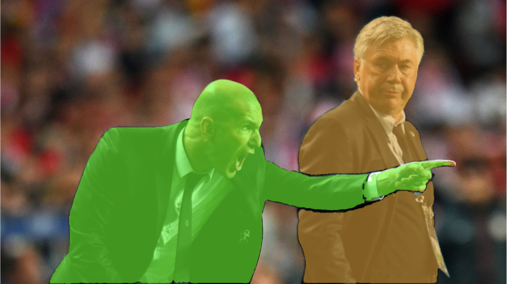

# auto-segment

<p align = "justify"> 
  This repo contains different tools to generate your own segmentation datasets using your objcet detection YOLOv8 models. This work is a continuation of the article <a href="https://blog.roboflow.com/how-to-use-yolov8-with-sam/"> "How to use YOLOv8 with SAM" </a>published by Arty Ariuntuya on Roboflow, in which she explained the power of both models working together.
</p>

## 🎭 segmentation mask

<p align = "justify">
  After performing object detection with YOLOv8, bounding boxes are sent to SAM, in order to make him understand which object do we want to get the mask from.
</p>

<p align = "center">
  
  
</p>

## 🏷️ segmentation dataset automation

<p align = "justify">
  In order to generate your custom segmentation dataset for YOLOv8, you will need to use your custom YOLOv8 object detection model and replace the default model path with yours.
</p>

<p align = "justify">
  After that you will download SAM weights using the following command:
</p>

```wget https://dl.fbaipublicfiles.com/segment_anything/sam_vit_h_4b8939.pth```


## 📚 sources

```bibtex
    @software{yolov8_ultralytics,
      author       = {Glenn Jocher and Ayush Chaurasia and Jing Qiu},
      title        = {Ultralytics YOLOv8},
      version      = {8.0.0},
      year         = {2023},
      url          = {https://github.com/ultralytics/ultralytics},
      orcid        = {0000-0001-5950-6979, 0000-0002-7603-6750, 0000-0003-3783-7069},
      license      = {AGPL-3.0}
    }
```